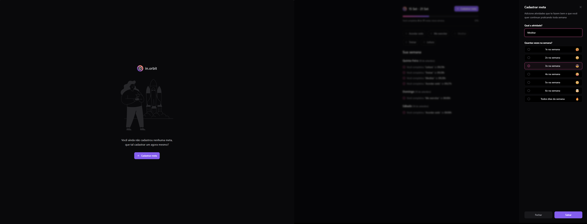

# 🧑‍🚀 In.orbit



## 📃 Descrição

Este projeto é um site para gerenciamento de metas semanais. Com ele, você pode:
- Criar metas semanais personalizadas.
- Visualizar o número total de metas criadas.
- Monitorar a data e o horário em que cada meta foi concluída.
- Acompanhar a porcentagem de metas concluídas ao longo da semana.

## ⚙️ Funcionalidades

- **Cadastro de metas**: Permite que o usuário adicione metas para serem concluídas ao longo da semana.
- **Armazenamento de metas**: Exibe a quantidade total de metas criadas.
- **Monitoramento de conclusão**: Armazena a data e a hora em que cada meta foi concluída.
- **Cálculo de desempenho**: Exibe a porcentagem de metas concluídas ao final de cada semana.

## 🖥️ Tecnologias Utilizadas

- **Frontend**: `ReactJS`, `TailwindCSS`, `Radix-ui`
- **Validação**: `Zod`
- **Gerenciamento de dados**: `Tanstack Query`
- **Ferramentas de Desenvolvimento**: `Vite`, `Biome.js` (para linting e formatação)
- **Backend**: `Node.js`, `Express` (backend separado)
- **Banco de Dados**: `PostgreSQL` (no backend)

## ⚒️ Instalação

### Pré-requisitos

Antes de começar, você precisará ter as seguintes ferramentas instaladas:
- [Node.js](https://nodejs.org/en/)
- [Git](https://git-scm.com/)

### Configurando o Backend

O projeto depende de um backend que deve ser clonado e configurado separadamente. Siga os passos abaixo para configurar o backend:

1. Clone o repositório do backend:

```bash
git clone https://github.com/devnestali/server_inorbit.git
```

2. Siga os passos para poder configurar o back-end: 

```bash
https://github.com/devnestali/server_inorbit
```

3. Para iniciar a aplicação, escreva o seguinte comando no seu terminal: 

```bash
npm run dev
```

